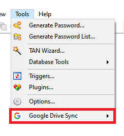
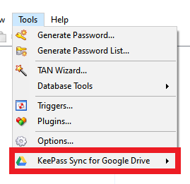
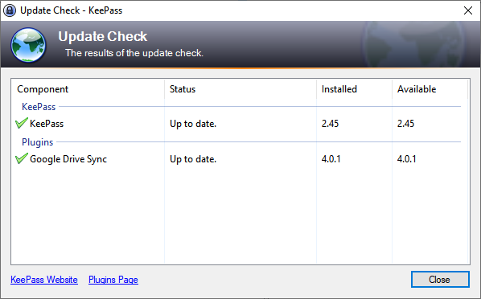
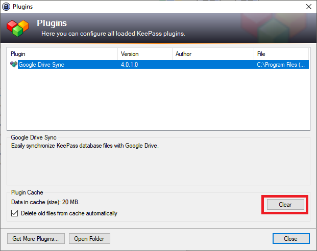

    This page is intended to help the Noble Brave Few, who
    installed the ALPHA version of the plugin, to upgrade to this
    latest, <em>much improved</em> release.

Thank you to everyone who has helped to this point.

Finally, we have a modern release of the rejuvenated *Google Sync 3.0* plugin
with usable, Google-sanctioned, built-in OAuth 2.0 credentials.
This was a primary goal when the effort started several months ago,
and with your feedback and coordination with Google, we can hopefully
look forward to several more years of safely using the plugin without
authorization issues.

Unfortunately minor, cosmetic changes to the ALPHA release were
required. The upgrade is quite simple for KeePass plugin veterans, but
the details are important to avoid the possibility of two different
versions of the plugin installed simultaneously.  Follow the links
below to upgrade via your chosen installation method.

And please, don't hesitate to raise a new
[issue](https://github.com/walterpg/google-drive-sync/issues)
if you have problems with the upgrade!

* [What has changed?](#what_changed) (Please review this first.)
* [Upgrading a Normal Installation from ALPHA.](#upgrading-a-normal-installation)
* [Upgrading a Portable Installation from ALPHA.](#upgrading-a-portable-installation)

---
### What Changed
Mostly, just names.  The name of the plugin and the file names of the
distribution binaries have changed from some form of 

##### ~~Google Drive Sync~~
to 
##### *KeePass Sync for Google Drive*.
    
All of these changes are transparently documented on [the site](/).

With apologies, the blame for this situation is completely ours.
We failed to anticipate the detailed requirements for verification. 
Hopefully this page and your continued use of the plugin is adequate
recompense.

Now, to the name changes.  Whereas the ALPHA versions displayed this menu...

{:refdef: style="text-align: center;"}

{: refdef}

...the new release's menu looks like this:

{:refdef: style="text-align: center;"}

{: refdef}

Also, the KeePass "Check For Updates" dialog will display something
like this when the **old**, ALPHA plugin is installed...

{:refdef: style="text-align: center;"}

{: refdef}

...whereas the new plugin will reflect the new name (if not this
version):

{:refdef: style="text-align: center;"}

{: refdef}

---
### Upgrading a Normal Installation
The instructions are the similar to those of the [installation
upgrade](./normal#upgrading) page, with the following changes:

1. Start KeePass.
2. Select the **Tools** ⟹ **Plugins** menu command.
3. Click the **Clear** button:
    

        
Attention:

        The Clear command will delete KeePass' cache of <em>ALL</em>
        plugin assemblies.  You should ensure that any other plugins
        you have installed are refreshed/updated, as you may 
        require, before performing this step.
    

    {:refdef: style="text-align: center;"}
    
    {: refdef}
4. Exit KeePass; ensure you have exited the program by checking
the Windows "notification tray" for the KeePass icon. If it's
still there, KeePass is still running - don't proceed until
the icon is gone.
5. Delete the old .PLGX file from the KeePass installation directory,
for example “C:\Program Files (x86)\KeePass Password Safe 2”.
The file to delete will have the old name, something like
`GoogleDriveSync-4.0.1-alpha.2.plgx`.
    

        KeePass also looks for .PLGX files in the "Plugins" directory,
        e.g., “C:\Program Files (x86)\KeePass Password Safe 2\Plugins”.
        Ensure there are no copies of the <code>GoogleDriveSync...plgx</code> file
        there either.
    

6. Now follow the instructions on the [Normal Installation page](../normal#installation-steps).
That is, copy the new plugin file, named something like 
`KeePassSyncForDrive-4.0.2.plgx`,
to the KeePass installation directory, e.g.,
“C:\Program Files (x86)\KeePass Password Safe 2”.
7. Restart KeePass.

---
### Upgrade a Portable Installation
You are in luck.  The instructions are very similar to the
[usual portable installation upgrade instructions](./portable#upgrading).

In fact, the instructions are identical.  Just note that some of the
files extracted from the new release's .ZIP archive will have
different names.

