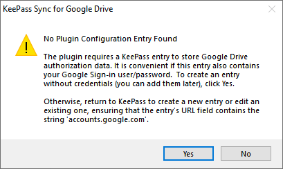
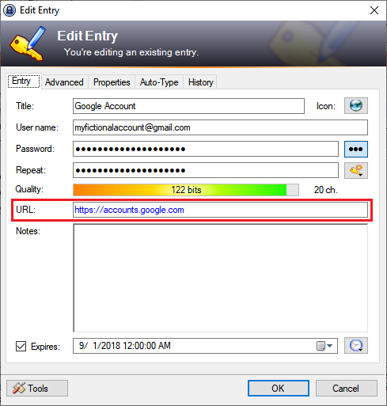
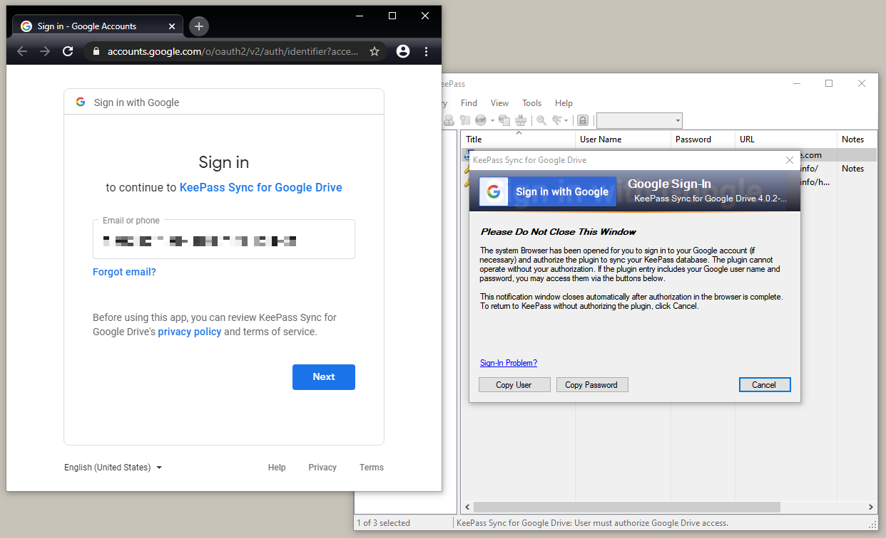

## Authorization
The plugin needs you to convince Google that it is authorized to access your Drive account and access and update KeePass database files stored there.  Your authorization is saved to the current database so you usually only have do this once.

## What Happens
* The first time you perform a plugin command with an unauthorized database, [you to use Sign-In to authenticate your Google account](#authentication) and authorize the plugin to access Drive.
* If authentication is valid, Google sends the plugin an authorization "token", which henceforth is proof of permitted access to your Drive account.
* The plugin saves the token *only* in the Google Drive Sync database entry; safe and secure in KeePass, nice!  The database is now authorized.
* Each time you use a plugin command, the token is presented to Google, via the [Drive APIs](https://developers.google.com/drive/).
* Occasionally Google, at their discretion, may invalidate or "expire" a saved token. If so, you must [authorize](#authentication) again to allow the plugin to proceed. Invalidation generally only occurs to ensure the safety of your account.

## How it Works
There are basically two scenarios that require Google Sign-In.
1. [New databases](#new-keepass-databases).
2. [Authenticating missing or expired tokens](#authentication).

## New KeePass Databases
When you create a new database, or use a pre-existing database for the first time, the plugin will not find an authorization token, and may not find a suitable entry for saving a granted token.  In the latter case, the plugin will produce this dialog:

You may either let the plugin create the required database entry, or cancel the dialog to return to KeePass.  In the latter case, if you wish to use the plugin, you must create a new KeePass entry in the database which is partially dedicated to saving Google Drive Sync configuration data, including the authorization token.  If you do create such an entry, note that it *must* contain this string in the URL field of the entry:

``accounts.google.com``

For example:

---
***NOTE***

It is highly recommended that regardless of the method used to create the entry, it should include your Google Drive user/password credentials.  The plugin can help you use these to Sign-In to authorize the plugin.

---

Once a Google Drive Sync entry is created in the database it stores authorization tokens (detailed below) and other per-database configuration information. 

## Authentication

When Google requires your authorization, you use Sign-In to authenticate. This should be a *very* infrequent occurrence. Like almost never, after the first time. Once initially authorized, the plugin saves the authorization token and uses it for all future plugin commands.

The plugin will prompt you by first displaying a KeePass dialog, and then directing your preferred web browser application to the Sign-In page, as shown:

Enter your credentials in the browser.  If the Google Drive Sync database entry has your Google user name and password, the KeePass dialog enables buttons in the dialog which invoke the KeePass "Copy User Name" or "Copy Password" commands, to allow you to paste these into the browser (this is why it's recommended to have this information in the Google Drive Sync entry).

If successful, the Sign-In page will notify the plugin and the KeePass dialog will close.  The browser will also direct you to return to KeePass.  The authorization token will be saved to the Google Drive Sync entry and it will remain valid for all future plugin commands until, if and when, it is expired by Google.

If for some reason you are reticent, distracted, or authentication fails on the Sign-In page, simply close the KeePass dialog with the Cancel button to return to KeePass.

