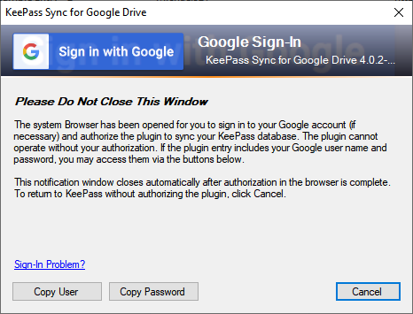
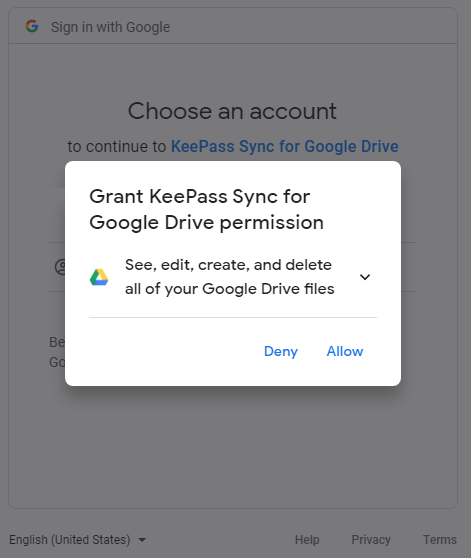
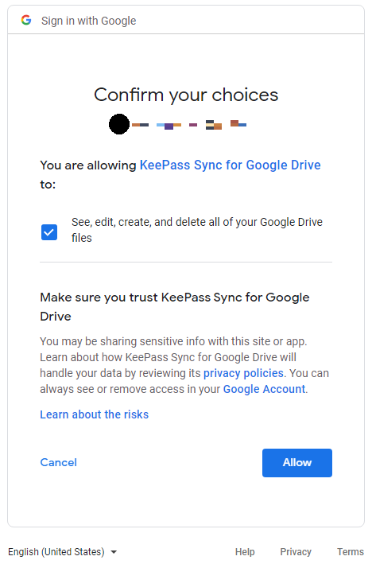

One way in which Google have improved the security of Google Drive
APIs in the last few years is by eliminating support for
older browsers and authentication mechanisms. For this reason, the
plugin is enhanced with approved techniques using
Google Sign-in.

Successful authorization results in Google issuing an authorization
token - thus you usually only need to authorize a new database once.

* [Authorization Walkthrough](#authorization-walkthrough)
* [Authorization Issues](#authorization-issues)
* [Authorization Tokens](#authorization-tokens)

---

#### Authorization Walkthrough

When you invoke a sync command from the plugin menu, the plugin
will determine if first you need to authorize.  If so, it will
display this prompt window:

{:refdef: style="text-align: center;"}

{: refdef}

This prompt notifies you that your consent is needed to operate
the plugin. Because the plugin also opens the Windows-default
web browser application, the prompt and KeePass may become hidden
behind the Google Sign-in page display. The image below shows
the plugin waiting for the user enter credentials in the 
Google Sign-in page.  The Google Sign-in page may have a different
appearance if the browser is already signed on to Google.

{:refdef: style="text-align: center;"}

{: refdef}

    Note that the plugin prompt dialog provides <b>Copy User</b> and
    <b>Copy Password</b> buttons.  If the
    <a href="../install/config">configured</a>
    plugin entry contains your Google credentials, these buttons
    are enabled. Clicking them invokes the KeePass clipboard
    copy function, to facilitate data entry in the Sign-in page.

After you successfully sign on in the browser, the Google authentication
service may prompt you confirm your consent, showing a page similar
to the image below:

{:refdef: style="text-align: center;"}

{: refdef}

While this warning is true, please understand that the plugin only
accesses Drive files that have the same name as your KeePass
database file.  The plugin does not access, create, or delete any
Drive file or folder except the KeePass database it is [configured](../install/config)
to access.  

If you click **Allow** above, you may then be prompted to affirm, as 
shown:

{:refdef: style="text-align: center;"}

{: refdef}

After you click **Allow**, the browser will show a "return to KeePass"
message.  The plugin will automatically close the prompt dialog, and
begin processing the command that initiated the authorization sequence.
If the command was [Sync with Drive](sync), KeePass will show
a message in its status bar after the command completes successfully,
such as shown below.

{:refdef: style="text-align: center;"}

{: refdef}

---

#### Authorization Issues

If Google Sign-in does not authorize the plugin,
the browser may display an error such as this:

{:refdef: style="text-align: center;"}

{: refdef}

If this or a similar error message appears, try
the following configuration options:

* Disable "legacy" credential options (this should always work).
* If you must use legacy credentials, enable the
[**Use Limited Drive Access**](x-40#limited-drive-access) option.
* Supply [your own OAuth 2.0 credentials](../usage/oauth).

    The legacy
    <a href="https://sourceforge.net/projects/kp-googlesync/">
    <em>KeePass Google Sync Plugin 3.0</em></a> built-in credentials 
    have been replaced, making obsolete the <b>Use Limited
    Drive Access</b> workaround, and personal OAuth 2.0 credentials.
    It is highly recommended to disable the legacy credentials
    option and use the new built-in credentials.

---

#### Authorization Tokens
When you successfully authorize, the Google Sign-in service issues
an authorization token which the plugin saves to the database.
This token is proof of your consent, and 
the plugin will henceforth send it in each request to use the Google
Drive API.

Because the token is securely saved in the database, you can use
plugin commands without reauthorizing each KeePass session.

Occasionally however, reauthorization will be required. There are
basically only two conditions which require the plugin to obtain a new
authorization token:

* Syncing a new database.
* Expired or authorization tokens retired by Google saved in an existing
database.

The latter case can occur when an authorization granted to
this or the old plugin for an existing database expires, or is 
inadvertantly revoked by a Google
["security checkup"](https://myaccount.google.com/security-checkup)
initiated by an unwary user.

The plugin initiates the [authorization sequence](#authorization-walkthrough)
whenever a command requires a new or refreshed token.
