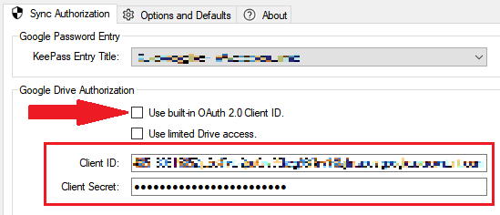

This feature will be deprecated in a future release, when the project
attains Google "verified app" status.  This will elevate the trust
level of associated program-specific OAuth 2.0 client credentials, and
this workaround will no longer be necessary.

One of the workaround functions devised by a previous release of the plugin is
the ability to use your own, Google-provided [OAuth 2.0](https://oauth.net/2/) client
credentials.  There are notable, if questionable, reasons for
doing this:

* **The Most Obvious Reason**: the current built-in credentials are no longer
"well-trusted" by Google.
* If you don't share the credentials with anyone, then no non-mechanical
third party can use them - they are a secret between you, Google, and the
KeePass program running on your PC.
* Though reasonably protected, and only useful with your expressed permission,
the built-in credentials could be compromised by unintended neglect or
nefarious means, and used to "spoof" the plugin's request for authorization.

If you have OAuth 2.0 [client credentials](https://www.oauth.com/oauth2-servers/access-tokens/client-credentials/)
in the form of a `client_id` and `client_secret`, you can configure the
plugin to use these to authorize plugin commands with the current database
by entering them in the appropriate text boxes of the **Sync Authorization**
tab of the Configuration dialog.  Ensure that the **Use built-in OAuth
2.0 Client ID** checkbox is un-checked to enable the text boxes.

    
WARNING

    When you change OAuth 2.0 credentials, the next time you use a
    plugin command you will be forced to reauthorize, by authenticating
    your Google account.

{:refdef: style="text-align: center;"}

{: refdef}

If you wish, you may also enter the credentials in the similar text boxes
of the **Options and Defaults** tab.  In this configuration, the plugin will
use the supplied credentials in all new databases.

---
#### Obtaining Personal OAuth 2.0 Credentials
Google currently allows any user to [obtain OAuth 2.0 client credentials](https://developers.google.com/identity/protocols/oauth2)
for access to its Drive and other APIs.  The process for doing so is designed
for developer use, and it changes periodically.  But generally it goes like this:

1. Log on to the [Google API Console](https://console.developers.google.com/).
2. Use the "Create a Project" link to create a space for your credentials.  
Name it something and click CREATE.
3. Click the "Credentials" link, then "CREATE CREDENTIALS".  A menu or 
screen appears.  Select "OAuth client ID" or something similar.
4. Click through various forms, including a configuration of the consent screen
that Google will display when you use the credentials.  This will help you
identify the use of the credentials later. 
5. Again, click "Credentials", then "CREATE CREDENTIALS". You may have to
enter yet more info, particularly "Application type", which you should indicate
as "other" or "native" (not "web" or "mobile").  Finally, click CREATE.
6. A screen showing your new credentials (the text named "client ID" and "client
secret") should appear.  Copy the credential somewhere safe (hi there KeePass!).
See the next section for hints about this.
